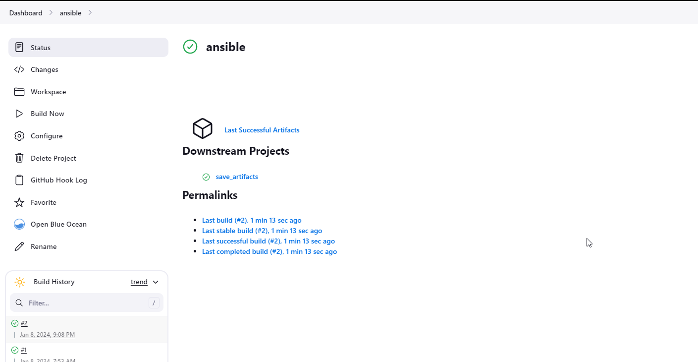
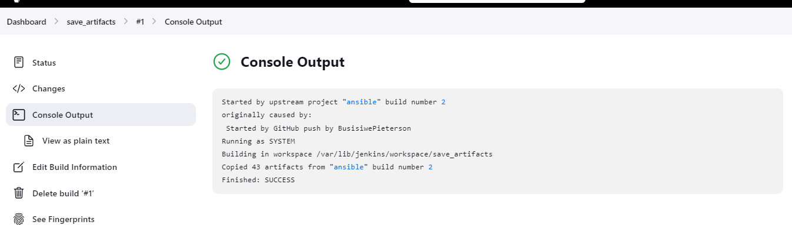
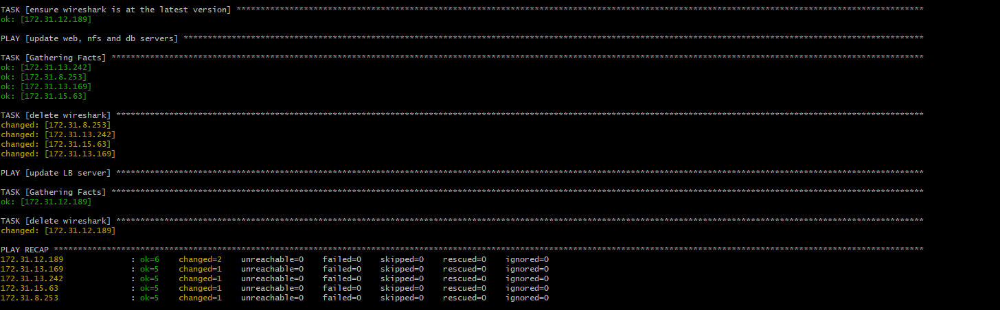
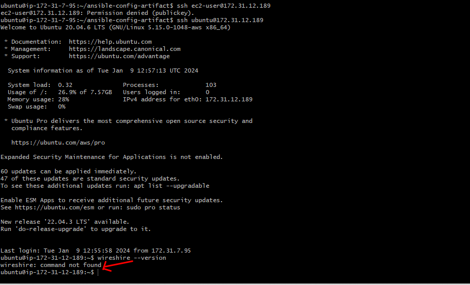
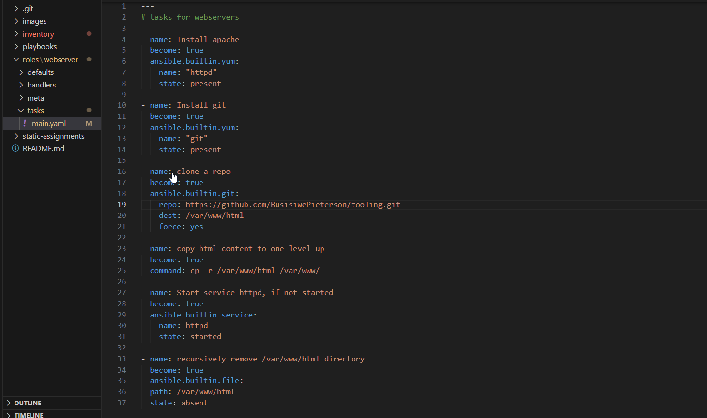

# Ansible Imports and Roles


In the last project https://github.com/BusisiwePieterson/ansible-config-mgt/tree/prj-11 all the tasks are written in a single playbook. It is pretty simple set of instructions for only 2 types of OS but imagine you have many more tasks and you need to apply this playbook to other servers with different requirements. In this case, you will have to read through the whole playbook to check if all tasks written there are applicable and there is anything that you need to add for certain server/OS families. Very fast it will become a tedious excersice and your playbook will become messy with many commented parts.

##
### Step 1 - Jenkins job enhancement
1. Go to your `Jenkins-Ansible` server and create a new directory called `asnibel-config-artifact` we will store there all the artifacts after each build.
    - Run `sudo mkdir /home/ubuntu/ansible-config-artifact`

2. Change permissions to the directory, so Jenkis could save files there. 
   - Run `chmod -R 0777 /home/ubuntu/ansible-config-artifact`


3. Go to Jenkins web console -> Manage Plugins -> on `Available` tab search for `Copy Artifact` and install this plugin without restarting Jenkins.


4. Create a new Freestyle project and name it `save_artifacts`.


5. This project will be triggered by the exiting `ansible` project. Configure as below.


6. The main idea of `save_artifacs` is to save artifacts into `/home/ubuntu/ansible-config-artifact` directory. To acieve this, create a **Build** step ans choose `Copy artifacts from other project`, specify `ansible` ans the source project and `/home/ubuntu/asnible-config-artifact` as the target directory.


7. Test your set by making some chnage in README.MD file inside your `ansible-config-mgt` repository.







##

### Step 2 - Refactor Ansible code by importing other playbooks into `site.yaml`

Create a new branch called `refactor`

Before starting to refactor the code, ensure that you have pulled down the latest code from `main` branch.


Now it is time to break tasks up into different files inorder to organize complex tasks and reuse them. 


1. Within `playbooks` folder, create a new file and name it `site.yml` – This file will now be considered as an entry point into the entire infrastructure configuration. Other playbooks will be included here as a reference. In other words, site.yml will become a parent to all other playbooks that will be developed. Including `common.yaml` that you created previously.

2. Create a new folder in root of the repository and name it `static-assignments`. The static-assignments folder is where all other children playbooks will be stored. 

3. Move `common.yaml` file into the newly created static-assignments folder.

4. Inside `site.yaml` file, import `common.yaml` playbook.

```---
- hosts: all
- import_playbook: ../static-assignments/common.yml

```

The code below uses built in **import_playbook** Ansible module.


5. Since you need to apply some tasks to your `dev` servers and `wireshark` is already installed – you can go ahead and create another playbook under `static-assignments` and name it `common-del.yaml`. In this playbook, configure deletion of wireshark utility.

    Remotely ssh into your Jenkins server using **ssh-agent**


   In `common-del.yaml` place the below playbook.

```
---
- name: update web and nfs servers
  hosts: webservers and nfs
  remote_user: ec2-user
  become: yes
  become_user: root
  tasks:
  - name: delete wireshark
    yum:
      name: wireshark
      state: removed

- name: update LB and DB servers
  hosts: lb, db 
  remote_user: ubuntu
  become: yes
  become_user: root
  tasks:
  - name: delete wireshark
    apt:
      name: wireshark-qt
      state: absent
      autoremove: yes
      purge: yes
      autoclean: yes
```
update `site.yaml` with - import_playbook: **../static-assignments/common-del.yaml** instead of `common.yaml` and run it against dev servers:

   - `cd /home/ubuntu/ansible-config-mgt/`

   - `ansible-playbook -i inventory/dev.yml playbooks/site.yaml`




Make sure that `wireshire` is deleted on all te servers by running `wireshark --version`



##

### Step 3 - Configure UAT Webservers with role `Webserver`

1. Launch 2 fresh EC2 instances using RHEL 8 image, we will use them as our `uat` servers, so give them names accordingly – `Web1-UAT` and `Web2-UAT`.


2. To create a role, you must create a directory called `roles/`, relative to the playbook file or in `/etc/ansible/` directory.

  - Create the `directory/files` structure manually


3. Update your inventory ansible-config-mgt/inventory/uat.yml file with IP addresses of your 2 UAT Web servers


5. It is time to start adding some logic to the webservers role. Go to into `tasks` directory and within the `main.yaml` file, start writing configuration tasks to do the following:

   - Install and configure Apache(httpd service)
   - Clone Tooling website from Github `https:github.com/<your-name>/tooling.git`.
   - Ensure the tooling website code is deployed to `/var/www/html` on each of the webservers.
   - Make sure httpd service is started.



4. In `/etc/ansible/ansible.cfg` file uncomment roles_path string and provide a full path to your roles directory roles_path = `/home/ubuntu/ansible-config-mgt/`roles, so Ansible could know where to find configured roles.


Within the `static-assignments` folder, create a new assignment for **uat-webservers** `uat-webservers.yaml`. This is where the role will be referenced.


Remember that the entry point to our ansible configuration is the `site.yaml` file. You need to refer your `uat-webservers.yaml` role inside `site.yaml`


### Step 5 - Commit and Test

Commit your changes, create a PR and merge them to `main` branch, make sure that the webhook triggered two consequent Jenkins jobs, they ran succesfully and copied all the files to your Jenkins server into `/home/ubuntu/ansible-config-mgt/`


